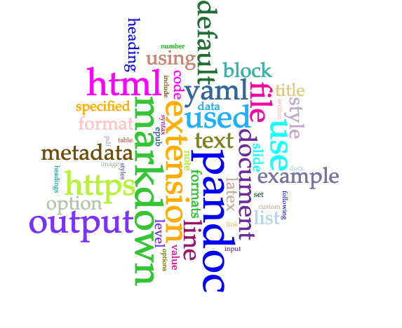

# Abstract

This is my abstract. 

# Introduction

This is my introduction.

# Methodology

This is my methodology.

## Data Collectiion

Describe where the data came from.[^fn1]

## Processing Data and Tool Use

# Results

These are my results. 

# Analysis

This is my analysis. 

# Discussion

This is my discussion. 

# Works Cited

Various works cited here. 

# Notes

[^fn1]: See https://wikipedia.org.